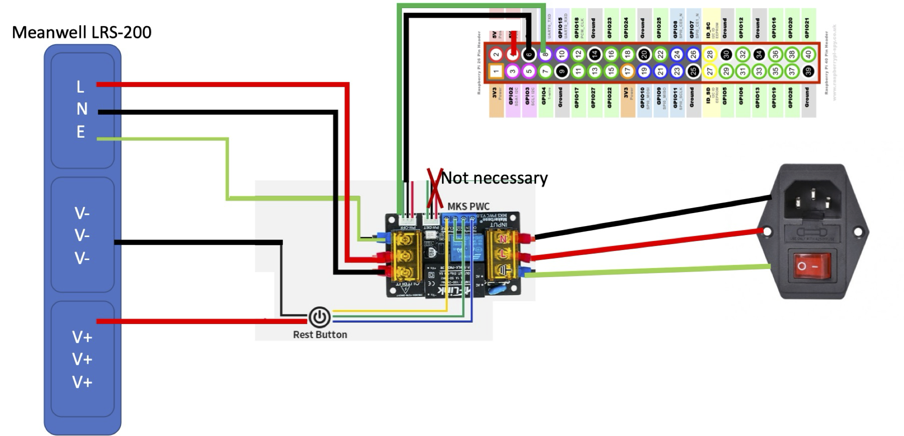
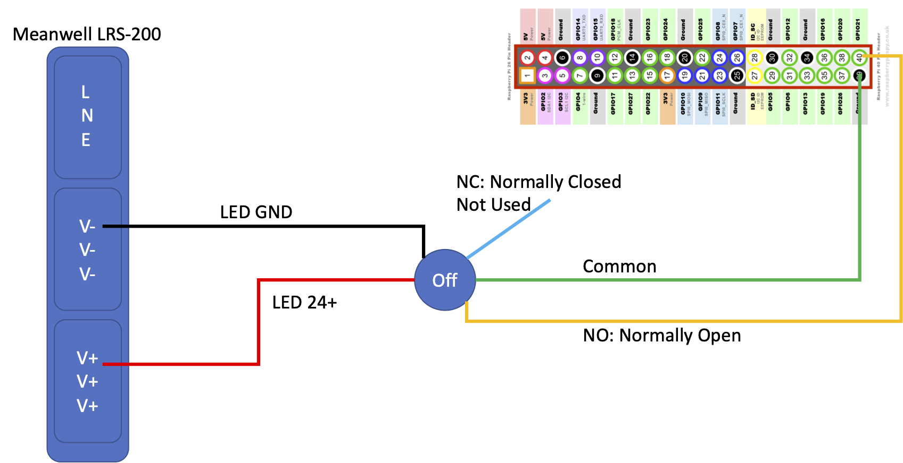

# Disclaimer
Wrong wiring can damage your raspberry pi, mcu board, and PSU. Double check correct wiring with your unit wire in/out. I am not responsible for any damages due to wrong wiring. My diagram may contain wrong connection. Please double check and do at your own risk. Report to me if you find any error.

# Soft power on-off using MKS PWC 3.0

You don't need to use POW-DET of MKS PWC 3.0.
For POW-OFF, connect 5V to RPI 5V, GND to GND, and PW-OFF to GPIO-14 (UART0 TX). You may use PIN 4, 6, and 8 of GPIO which are in a row.

To make the PWC 3.0 keep powered on assuming you connected signal line of POW-OFF of PWC 3.0 to GPIO14 (uart0), following line should be added to /boot/config.txt

enable_uart=1

With raspberry pi 4b, shutdown should be automatic with the setting.

# For CM4 connected to Manta M4P, M5P or M8P:
The GPIO14 does not go into 0V state automatically after shutdown of CM4. To trigger the complete shutdown do the following.  
Copy the set-gpio14-down.sh file to /usr/lib/systemd/system-shutdown/  
Use sudo cp set-gpio14-down.sh /usr/lib/systemd/system-shutdown/  
Check the permission and ownership are correct:  
pi@trident250:/usr/lib/systemd/system-shutdown $ ll  
total 4  
-rwxr-xr-x 1 root root 139 Mar  5 13:20 set-gpio-14-down.sh  
You may do  
sudo chown root set-gpio-14-down.sh  
sudo chgrp root set-gpio-14-down.sh  

# Power-off switch
https://raspberrypi.stackexchange.com/questions/117013/raspberry-pi-4-b-gpio-boot-and-shutdown-buttons

For soft button power off, you need a separate momentary switch with 24v LED. 16mm switch is recommended to use the button mount for the skirt. After wiring to the raspberry pi, you need to add the following lines to /boot/config.txt

\# For shutdown  
dtoverlay=gpio-shutdown,gpio_pin=21

# Official documentation of the product
https://github.com/makerbase-mks/MKS-Power-Control/wiki/MKS-PWC-V3.0-user-Manual

# For button mount
https://www.thingiverse.com/thing:4222174
