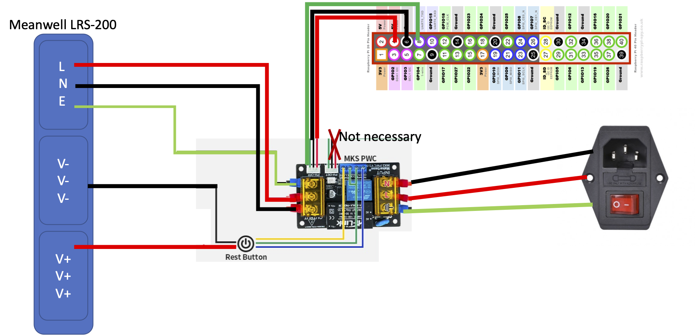

# Soft power on-off using MKS PWC 3.0

You don't need to use POW-DET of MKS PWC 3.0.
For POW-OFF, connect 5V to RPI 5V, GND to GND, and PW-OFF to GPIO-14 (UART0 TX). You may use PIN 2, 4, and 6 of GPIO which are in a row.

To make the PWC 3.0 to keep powered on assuming you connected signal line of POWOFF of PWC 3.0 to GPIO14 (uart0), following line should be added to /boot/config.txt

enable_uart=1

With raspberry pi 4b, shutdown should be automatic with the setting.

# For CM4 connected to Manta M4P, M5P or M8P:
The GPIO14 does not go into 0V state automatically after shutdown of CM4. To trigger the complete shutdown do the following.
Copy the set-gpio14-down.sh file to /usr/lib/systemd/system-shutdown/
Use sudo cp set-gpio14-down.sh /usr/lib/systemd/system-shutdown/
Check the permission and ownership are correct:
pi@trident250:/usr/lib/systemd/system-shutdown $ ll
total 4
-rwxr-xr-x 1 root root 139 Mar  5 13:20 set-gpio-14-down.sh
You may 
sudo chown root set-gpio-14-down.sh
sudo chgrp root set-gpio-14-down.sh

# Official documentation of the product
https://github.com/makerbase-mks/MKS-Power-Control/wiki/MKS-PWC-V3.0-user-Manual

